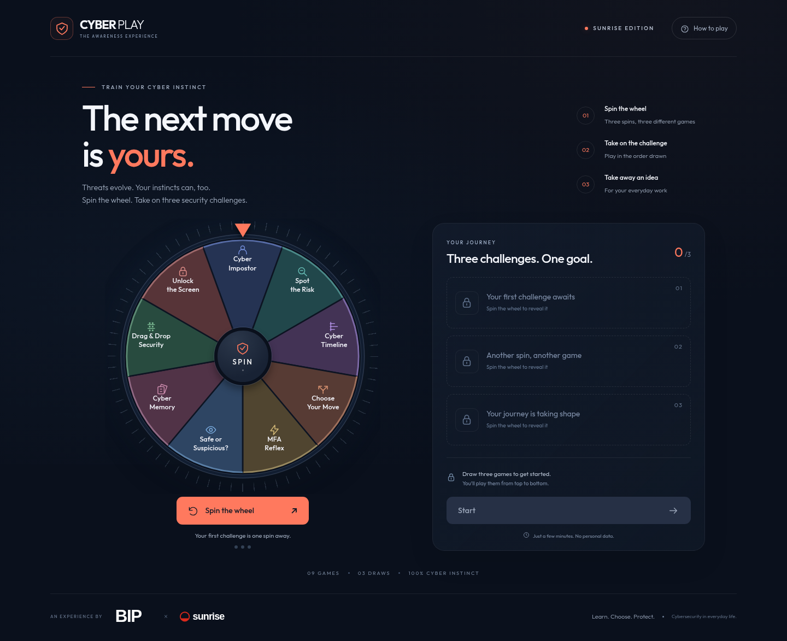

# Chatgpt

## Cyber Play — BIP × Sunrise

An English-language cybersecurity awareness game with an animated wheel, three unique random draws and nine interactive mini-games.

The full project is in **[sunrise-cyber-game](sunrise-cyber-game/README.md)**.

### Download and play

1. Select **Code → Download ZIP** on this repository.
2. Extract the entire ZIP.
3. Open **`sunrise-cyber-game/index.html`** in a current browser.

Alternatively, open [Sunrise_Cyber_Play_EN.html](sunrise-cyber-game/Sunrise_Cyber_Play_EN.html) on GitHub and use **Download raw file**. The downloaded HTML contains the entire game and can run on its own.

The game works offline and requires no accounts, API keys or runtime dependencies. Source code, local assets, previews, development tests and build instructions are included. This repository contains the files; GitHub Pages hosting has not been enabled.

The complete BIP and Sunrise wordmarks are provisional. Replace them with approved brand assets before using the game at an event; see the [project README](sunrise-cyber-game/README.md#logos-replace-before-the-event).

